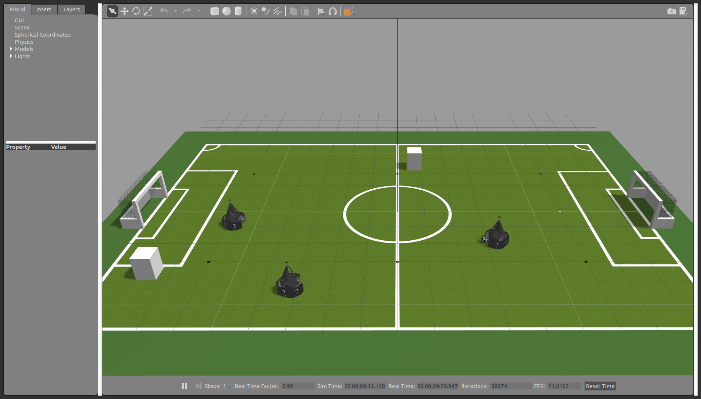
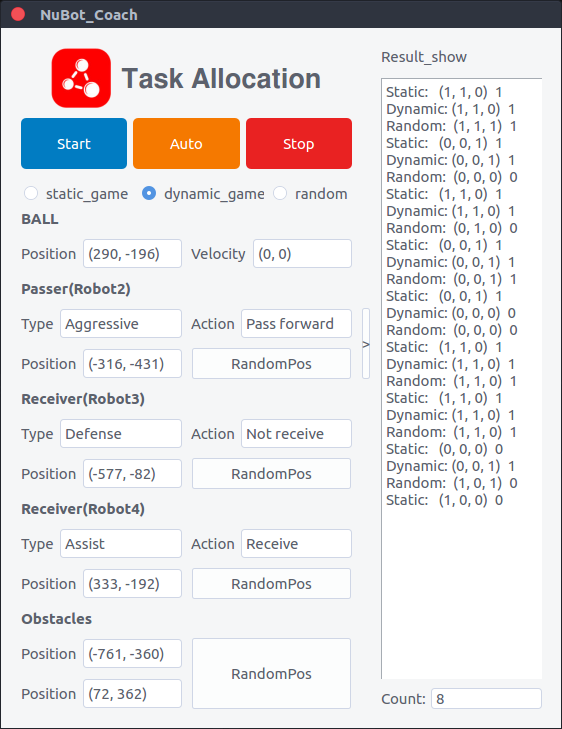

# task_allocation_gazebo
The code for task allocation and the simulation system based on ROS and Gazebo for task allocation are included 

###gazebo_visual

The workspace is for Gazebo visualization, and you can launch the Gazebo first by using following command. 

`$ source gazebo_visual/devel/setup.sh`

`$ roslaunch nubot_gazebo game_ready.launch`

### task_allocation

The Qt UI for control terminal and the code for task allocation are included in this workspace, and you can launch the robot's process and control terminal by using following command. Before that you must launch the gazebo_visual first.

`$  ./task_allocation/src/task_allocation.sh `

